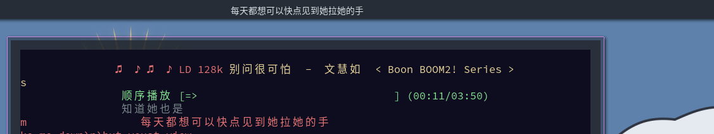

# awesomewm-musicbox-lyrics-widget
## 效果展示


## 准备
   安装 [musicbox](https://github.com/darknessomi/musicbox) 歌词依赖（主要是 `dbus-python`,其中 qt 相关的可以不安装）

## 使用


克隆本项目到awesomewm配置目录下，修改 awesomewm 配置文件

```lua
local lyrics = require("path.to.clone") 

local widget = lyrics({max_width = 300})

-- 将 widget 绑定到你 wibox 或 wibar上
-- ......

```

运行下列命令启动 dbus 服务（推荐设置自动启动）

``` shell
python dbus-service.py
```

运行 musicbox，应该就可以看到歌词了---

## 存在的问题

**Q: 不能和musicbox自带的桌面歌词同时使用？**

A: 由于目前musicbox自带的桌面歌词，需要注册dbus服务，会和 dbus-service.py 冲突，所以在不修改 musicbox 源代码的情况下没办法同时使用。

**Q: 为什么要多弄一个Python文件？不能都用lua写吗？**

A: musicbox 使用的是 method_call 的方式传输歌词的，awesomewm 里 dbus 相关的 api 好像只能发送或接收 signal，所以---（如果是我没看到的话，请务必告诉我）。
